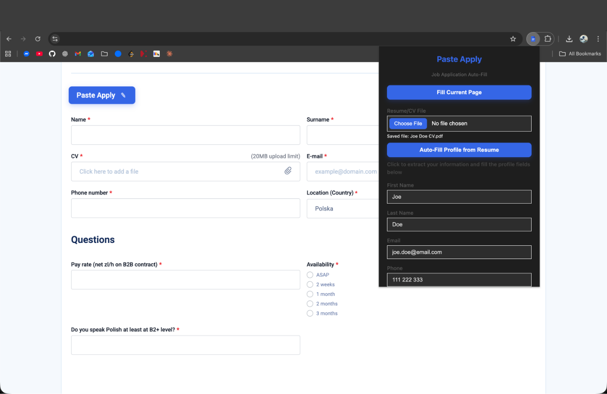

# 🚀 Paste Apply

> **Automatically fill job application forms with your saved information**

Paste Apply is a powerful Chrome extension that streamlines your job application process by automatically filling out repetitive form fields. Save your profile information once, and let Paste Apply handle the rest—saving you time and reducing errors.

---

## ✨ Features

- 📄 **Resume Parsing** - Upload your resume (PDF, DOC, DOCX) and automatically extract contact information
- 💾 **Profile Management** - Save your personal information, contact details, and social profiles in one place
- 🎯 **Smart Form Filling** - Automatically detects and fills form fields on any job application website
- 🔒 **Privacy First** - All data is stored locally in your browser—nothing is sent to external servers
- ⚡ **One-Click Fill** - Fill entire forms with a single click or keyboard shortcut
- 🔄 **Cross-Device Sync** - Your profile syncs across devices when signed into Chrome

---

## 📸 Screenshots

### Main Interface


The extension popup provides an intuitive interface where you can:
- Upload and parse your resume to auto-fill profile information
- Manually enter or edit your profile details
- Save your information for quick access
- Configure settings to show auto-fill buttons on job pages

### Form Filling in Action


See Paste Apply in action as it intelligently matches and fills form fields on job application pages, making the application process faster and more efficient.

---

## 🛠️ Installation

### From Source

1. Clone or download this repository
2. Open Chrome and navigate to `chrome://extensions/`
3. Enable **Developer mode** (toggle in the top right)
4. Click **Load unpacked**
5. Select the extension directory
6. The Paste Apply icon should now appear in your browser toolbar

### Building from Source

```bash
npm install
npm run build
npm run package
```

---

## 📖 Usage

### Setting Up Your Profile

1. **Click the Paste Apply icon** in your browser toolbar
2. **Upload your resume** (optional):
   - Click "Choose File" and select your resume (PDF, DOC, or DOCX)
   - Click "Auto-Fill Profile from Resume" to extract information
3. **Review and edit** the auto-filled information
4. **Add any missing details** (GitHub, LinkedIn, portfolio, etc.)
5. **Click "Save Profile"** to store your information

### Filling Job Applications

1. Navigate to a job application page
2. **Option 1**: Click the **"Fill Current Page"** button in the extension popup
3. **Option 2**: Use the keyboard shortcut **Ctrl+Shift+F** (Windows/Linux) or **Cmd+Shift+F** (Mac)
4. Paste Apply will automatically detect and fill matching form fields

---

## 🔧 Configuration

### Settings

- **Show Auto-Fill button on job application pages**: Enable this to display a floating button on pages that appear to be job applications

### Keyboard Shortcuts

- **Fill Form**: `Ctrl+Shift+F` (Windows/Linux) or `Cmd+Shift+F` (Mac)

---

## 📋 Supported Profile Fields

- First Name
- Last Name
- Email Address
- Phone Number
- GitHub Profile URL
- LinkedIn Profile URL
- Portfolio/Website URL
- City
- Country

---

## 🔒 Privacy & Security

Paste Apply is designed with privacy in mind:

- ✅ **100% Local Storage** - All data is stored locally in your browser
- ✅ **No External Servers** - No data is transmitted to external services
- ✅ **No Tracking** - We don't collect analytics or usage statistics
- ✅ **Secure** - Uses Chrome's built-in secure storage APIs

For more details, see our [Privacy Policy](PRIVACY_POLICY.md).

---

## 🎯 How It Works

1. **Field Detection**: The extension uses intelligent algorithms to identify form fields on web pages
2. **Pattern Matching**: It matches detected fields with your saved profile information
3. **Smart Filling**: Automatically fills matching fields with your data
4. **Validation**: Ensures data is filled correctly and handles edge cases

---

## 🚧 Requirements

- Google Chrome (or Chromium-based browser)
- Chrome version 88+ (for Manifest V3 support)

---

## 📝 License

[Add your license information here]

---

## 🤝 Contributing

Contributions are welcome! Please feel free to submit a Pull Request.

---

## 📧 Support

For issues, questions, or feature requests, please [open an issue](https://github.com/yourusername/paste-apply/issues).

---

## 🎉 Version

**Current Version:** 1.0.1

---

*Made with ❤️ to make job applications easier*

